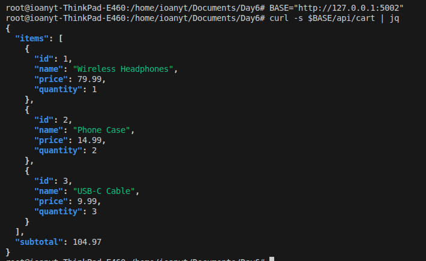
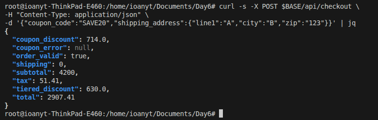
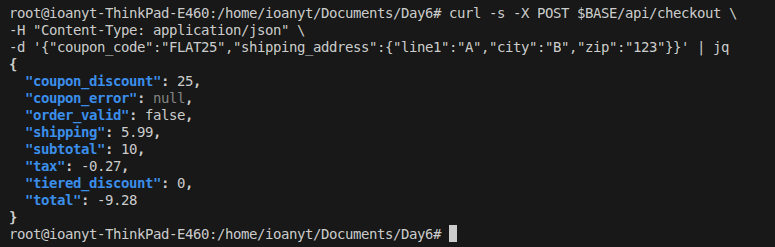
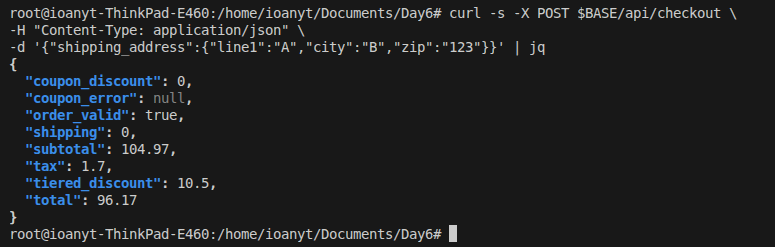
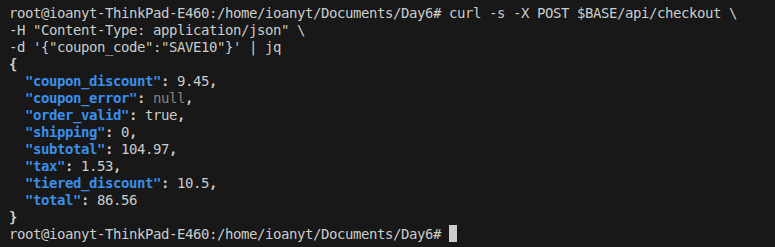

# 🐛 BUG-REPORT.md — ShopEasy Checkout System

---

## 🐛 Bug 1: Subtotal ignores quantity
- **Severity:** Critical

- **Steps to reproduce:**
  1. Add items with quantity > 1 in cart
  2. Call `/api/cart` or `/api/checkout`

- **Expected behavior:**
  Subtotal should be calculated as `price × quantity` for each item

- **Actual behavior:**
  Only item price is summed, ignoring quantity

- **Evidence:**
  Expected: $139.94  
  Actual: $104.97

    
---

## 🐛 Bug 2: Missing $500 cap on percentage discounts
- **Severity:** Major

- **Steps to reproduce:**
  1. Create large cart value (e.g., $10,000)
  2. Apply `SAVE20` coupon

- **Expected behavior:**
  Discount should be capped at $500

- **Actual behavior:**
  Discount exceeds allowed limit

- **Evidence:**
  No cap enforcement in percent discount logic

    

---

## 🐛 Bug 3: Fixed discount can produce negative totals
- **Severity:** Major

- **Steps to reproduce:**
  1. Add items totaling less than coupon value
  2. Apply `FLAT25` on $20 cart

- **Expected behavior:**
  Discount should not exceed subtotal

- **Actual behavior:**
  Total becomes negative (e.g., -$5)

- **Evidence:**
  Missing `min(subtotal, discount)` protection

    

---

## 🐛 Bug 4: BOGO selects most expensive item instead of cheapest
- **Severity:** Major

- **Steps to reproduce:**
  1. Add multiple items with different prices
  2. Apply `BOGO` coupon

- **Expected behavior:**
  Cheapest item should be discounted

- **Actual behavior:**
  Most expensive item is discounted

- **Evidence:**
  Sorting uses descending order instead of ascending

    

---

## 🐛 Bug 5: Tax rate incorrectly set to 1.8% instead of 18%
- **Severity:** Critical

- **Steps to reproduce:**
  1. Complete checkout
  2. Observe tax calculation

- **Expected behavior:**
  Tax = 18% of taxable amount

- **Actual behavior:**
  Tax = 1.8% (incorrect)

- **Evidence:**
  `0.018` used instead of `0.18`

    

---

## 🐛 Bug 6: Shipping uses pre-discount subtotal
- **Severity:** Major

- **Steps to reproduce:**
  1. Apply discount reducing order value
  2. Check shipping charge

- **Expected behavior:**
  Shipping should be based on post-discount subtotal

- **Actual behavior:**
  Uses original subtotal

- **Evidence:**
  Incorrect function dependency

    

---

## 🐛 Bug 7: Missing shipping address validation
- **Severity:** Major

- **Steps to reproduce:**
  1. Send checkout request with empty shipping address
  2. Or omit required fields

- **Expected behavior:**
  Request should be rejected

- **Actual behavior:**
  Order proceeds without validation

- **Evidence:**
  No strict field validation implemented

    

---

## 🐛 Bug 8: Incorrect minimum order validation logic
- **Severity:** Minor

- **Steps to reproduce:**
  1. Reduce subtotal near minimum threshold
  2. Observe validation result

- **Expected behavior:**
  Validation based on discounted subtotal

- **Actual behavior:**
  Uses final total including tax/shipping

- **Evidence:**
  Wrong comparison field used

    

---
