POST /notes — creates a note ✓
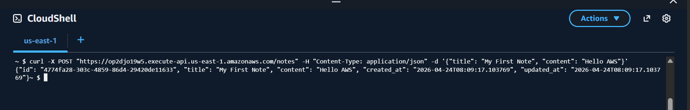
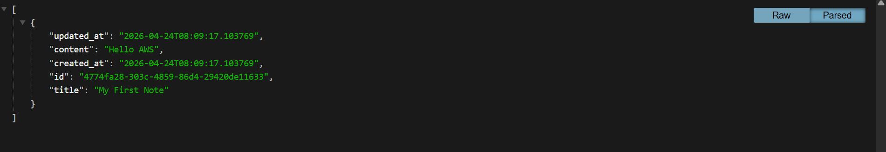
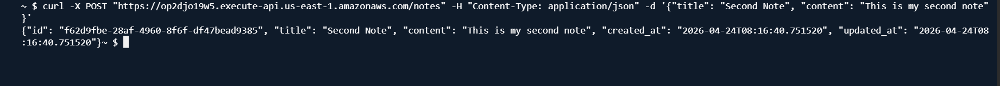
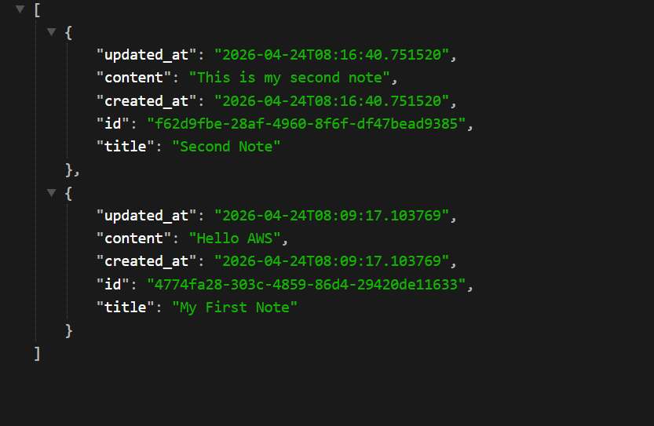

---------------------------------------------------------------------------------------------------
GET /notes — lists all notes ✓
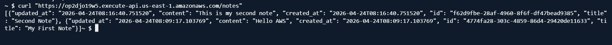

---------------------------------------------------------------------------------------------------
GET /notes/{id} — retrieves specific note ✓
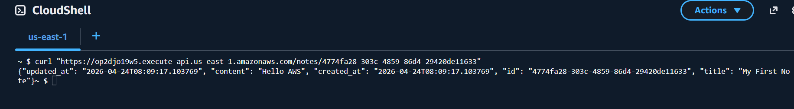
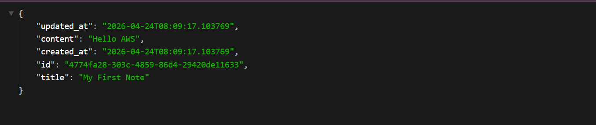

---------------------------------------------------------------------------------------------------
PUT /notes/{id} — updates a note ✓
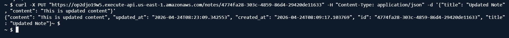
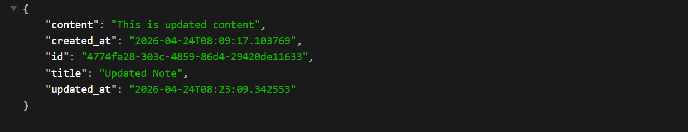

---------------------------------------------------------------------------------------------------
DELETE /notes/{id} — deletes a note ✓
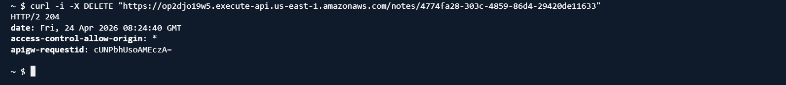
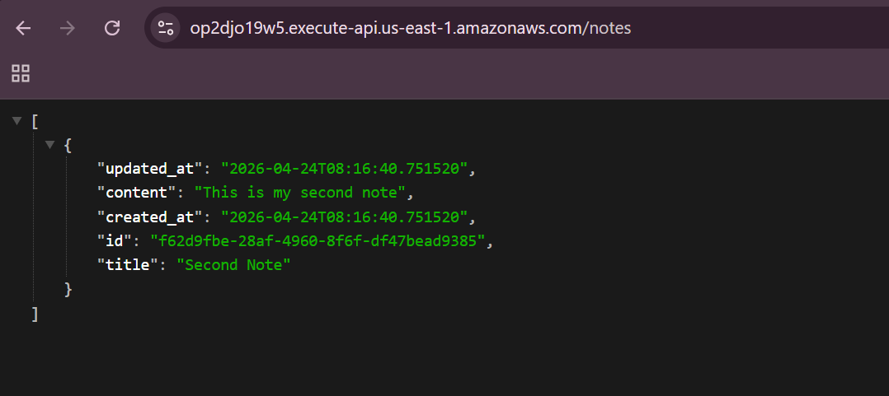

---------------------------------------------------------------------------------------------------
Edge case: empty title returns error ✓
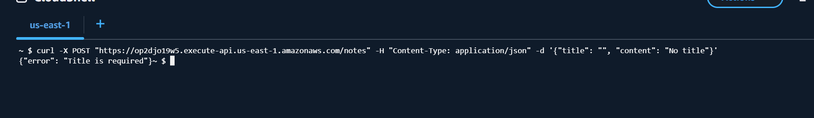

---------------------------------------------------------------------------------------------------
Edge case: non-existent ID returns 404 ✓
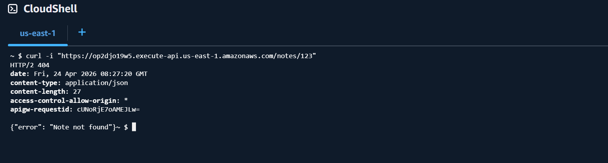
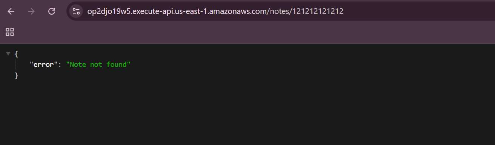

---------------------------------------------------------------------------------------------------